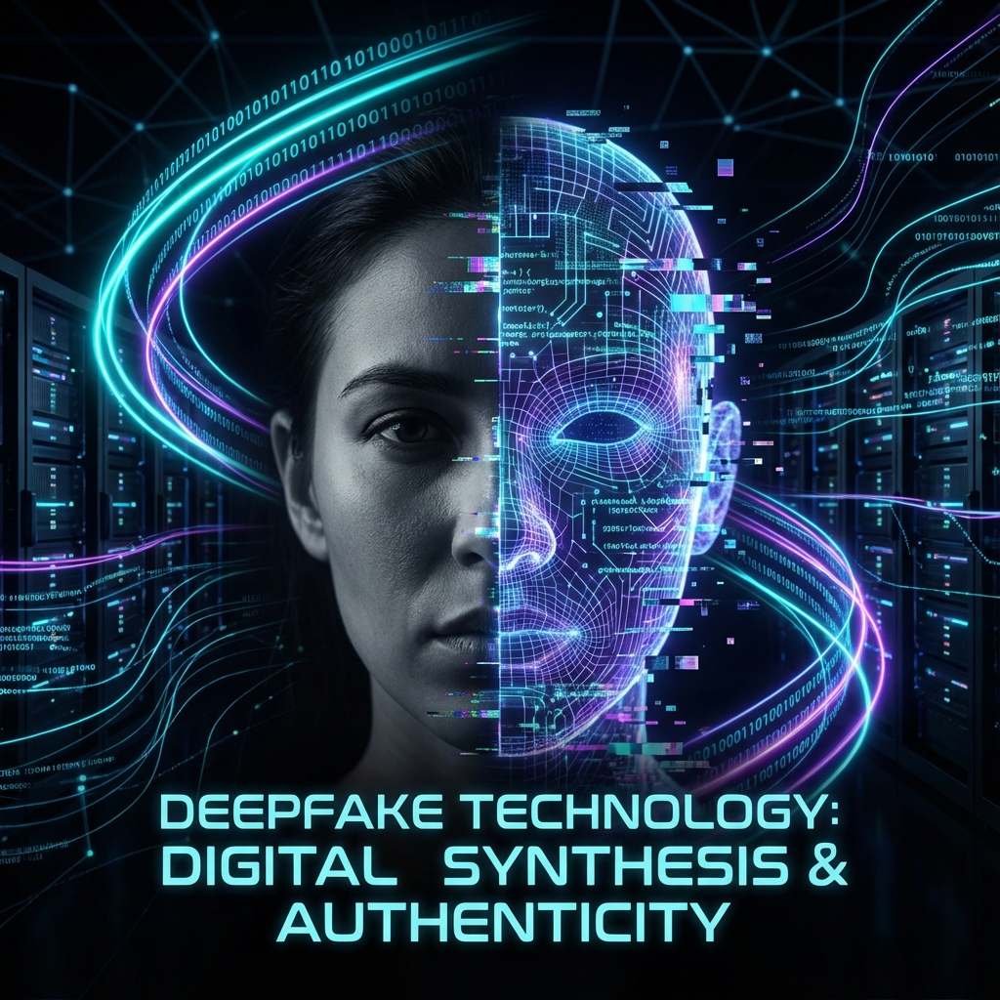

# 🎭 Deepfake Teknolojisi ve Tespit Yöntemleri

*Yapay Zeka ile Gerçeklik Manipülasyonu*

---

## 🧐 Nedir?

Deepfake, "Deep Learning" (Derin Öğrenme) ve "Fake" (Sahte) kelimelerinin birleşiminden oluşur. Üretken Çekişmeli Ağlar (GAN) veya Difüzyon Modelleri kullanılarak, mevcut bir görüntü veya videoda bir kişinin yüzünü bir başkasınınkiyle değiştirmek veya hiç var olmayan yapay içerikler üretmek için kullanılır.

## 🛠️ Nasıl Çalışır?

Deepfake üretimi genellikle **Encoder-Decoder** yapısına dayanır:

1.  **Encoder**: Binlerce yüz görüntüsünü analiz ederek yüzün temel özelliklerini (göz aralığı, mimikler, ışıklandırma) sıkıştırılmış bir vektöre dönüştürür.
2.  **Decoder**: Bu vektörden tekrar yüz görüntüsü oluşturur.
3.  **Swap İşlemi**: Kaynak kişinin yüzünü kodlayan encoder ile hedef kişinin yüzünü oluşturan decoder çapraz kullanıldığında yüz değişimi gerçekleşir.

> [!WARNING]
> Deepfake teknolojisi eğlence amaçlı (sinema, filtreler) kullanılabileceği gibi, dezenformasyon, dolandırıcılık ve itibar suikasti gibi kötü niyetli amaçlarla da kullanılabilir.

## 🛡️ Tespit Yöntemleri (Detection)

Bu repoda ve modern literatürde kullanılan temel tespit yöntemleri şunlardır:

### 1. Biyolojik Sinyaller
*   **Göz Kırpma Analizi**: Eski Deepfake modelleri göz kırpmayı simüle edemiyordu.
*   **Kalp Atışı (rPPG)**: Videodaki yüzdeki mikroskobik renk değişimlerinden nabız tespiti. Deepfake videolarında bu sinyal genellikle bozuktur.

### 2. Doku ve Frekans Analizi
*   **CNN Modelleri**: Kare kare analiz yaparak piksellerdeki yapaylıkları (artifacts) arar.
*   **Mesoscope Analizi**: Göz bebeği yansımasındaki uyumsuzlukları inceler.

### 3. Zaman Tutarsızlıkları
*   **LSTM / RNN**: Videodaki kareler arası geçişlerin doğallığını kontrol eder. Dudak senkronizasyonu (Lip-sync) hatalarını yakalar.

## 🚀 Bu Repodaki Örnekler

`eğitim_kodları/03_Generative_AI/` klasöründe:
*   `14_ganSahteYuz.py`: Basit bir GAN ile sentetik yüz üretimi.
*   `15_difuzyonSahteYuz.py`: Difüzyon modeli mantığıyla gürültüden görüntü oluşturma.

---

  <a href="../README.md">← Ana Sayfaya Dön</a>

