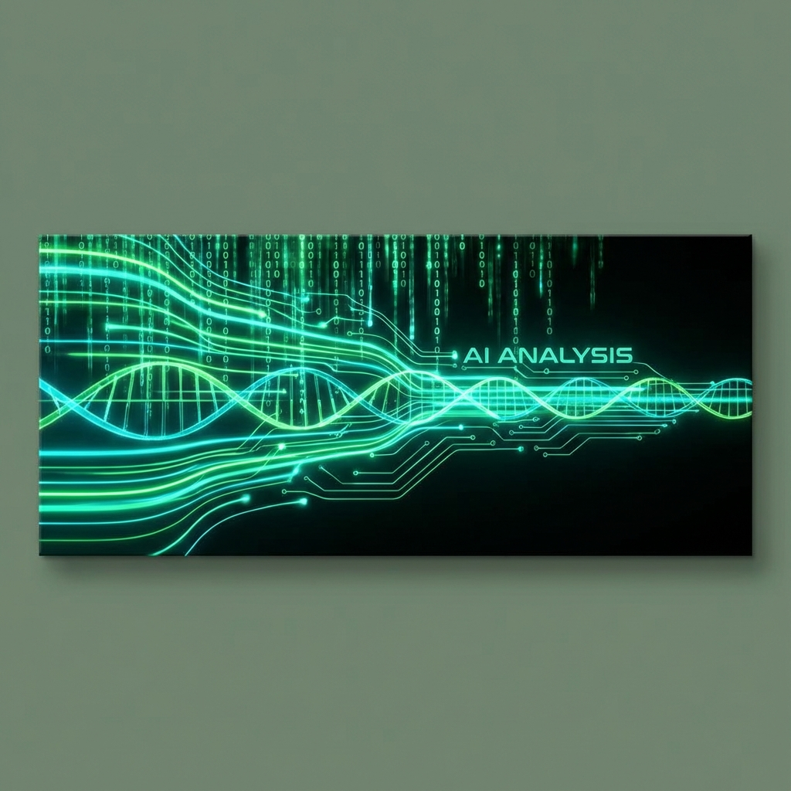

<div align="center">


# 🛡️ Multimedya Veri Güvenliğinde Yapay Zeka

_BTK Atölye • Multimedya Güvenliği • Eğitim ve Örnek Proje Repo_

[](https://www.python.org/)
[](https://pytorch.org/)
[](LICENSE)
[]()
[](CONTRIBUTING.md)

</div>

---

> **Note**: This repository combines lecture notes and example Python code about using AI for multimedia security (deepfake detection, steganography, watermarking, anomaly detection, and basic crypto / access control). It is designed as a **teaching resource**, not a production-ready system.

---

## 🔍 Proje Hakkında (TL;DR)

Bu repo, multimedya güvenliği ve yapay zeka kesişimindeki konuları ele alan kapsamlı bir eğitim kaynağıdır:

*   **Ders Notları**: Multimedya güvenliğinde YZ'nin rolü.
*   **Konu Özetleri**: [Deepfake](deepfake/README.md), [Steganografi](stegonografi/README.md), [Ransomware](docs/ransomware.md), [USOM](docs/usom.md).
*   **Örnek Kodlar**: `multimedya-guvenligi-ai/` altında uygulama iskeletleri.


Hem teorik bilgi hem de pratik kod uygulamaları (CNN, GAN, Autoencoder vb.) içerir.

## 📚 İçindekiler

1.  [Proje Yapısı](#-proje-yapısı)
2.  [Kurulum ve Kullanım](#️-kurulum-ve-kullanım)
3.  [Yapay Zeka ve Veri Güvenliği](#-yapay-zeka-ve-veri-güvenliği)
4.  [Uygulama Alanları](#-uygulama-alanları)
5.  [Kullanılan Modeller](#-kullanılan-modeller)
6.  [Katkıda Bulunma](#-katkıda-bulunma)

---

## 📂 Proje Yapısı

```
btk_atolye_multimedya_guvenligi/
├── 📂 assets/                  # Proje görselleri
├── 📂 eğitim_kodları/          # Makine öğrenmesi ve CNN örnekleri
│   ├── 01_Temel_ML/            # Regresyon, Sınıflandırma
│   ├── 02_Derin_Ogrenme/       # CNN, Transfer Learning
│   └── 03_Generative_AI/       # GAN, Diffusion, SIFT, EXIF
├── 📂 multimedya-guvenligi-ai/ # Örnek proje iskeleti
├── 📂 deepfake/                # Deepfake notları ve araştırmaları
├── 📂 stegonografi/            # Steganografi teknikleri
├── 📄 colab_turuba_rehberi.md  # Colab kullanım rehberi
└── 📄 requirements.txt         # Bağımlılıklar
```

---

## 🛠️ Kurulum ve Kullanım

Projeyi yerel ortamınızda çalıştırmak için:

### 1. Repoyu Klonlayın
```bash
git clone https://github.com/bahattinyunus/btk_atolye_multimedya_guvenligi.git
cd btk_atolye_multimedya_guvenligi
```

### 2. Sanal Ortam Oluşturun
```bash
# Windows
python -m venv venv
venv\Scripts\activate

# Mac/Linux
source venv/bin/activate
```

### 3. Bağımlılıkları Yükleyin
```bash
pip install -r requirements.txt
```

### 4. Örnekleri Çalıştırın
Örneğin, CNN modelini test etmek için:
```bash
cd eğitim_kodları
python 10_cnnDenemesi.py
```

---

## 🧠 Yapay Zeka ve Veri Güvenliği

Yapay zeka, siber güvenlikte "kılıç ve kalkan" gibidir. Hem saldırı (deepfake üretimi) hem de savunma (anomali tespiti) tarafında kullanılır. Bu repo, savunma tarafına odaklanarak aşağıdaki hedefleri gözetir:

*   **Erken Tespit**: Saldırıları gerçekleşmeden fark etme.
*   **Veri Bütünlüğü**: İçerik manipülasyonunu (Deepfake) yakalama.
*   **Telif Hakkı**: Dijital filigran (Watermarking) ile koruma.

---

## 🔐 Uygulama Alanları

### 1. Anomali Tespiti
Sunucudaki olağan dışı trafik veya dosya erişimlerini (DDoS, yetkisiz erişim) `Isolation Forest` veya `Autoencoder` ile tespit etme.

### 2. Deepfake Tespiti
Yüz manipülasyonlarını, göz kırpma düzensizliklerini ve "texture artifact" hatalarını `CNN` ve `ViT` modelleriyle yakalama.

### 3. Steganografi ve Filigran
Görünmez verileri resim içine saklama veya saklanmış verileri (gizli mesaj, virüs) tespit etme.

---

<div align="center">



</div>

---

## 🤖 Kullanılan Modeller

| Alan | Model | Amaç |
|------|-------|------|
| **Görüntü İşleme** | CNN, ResNet | İçerik sınıflandırma ve deepfake analizi |
| **Anomali** | Autoencoder, LSTM | Davranış analizi ve tehdit tespiti |
| **Generative** | GAN, Diffusion | Filigran üretimi ve sentetik veri |

---

## 🔐 Nasıl Çalışır? (Architecture)

Aşağıdaki diyagram, bu repoda ele alınan güvenlik modelinin genel akışını gösterir:

```mermaid
graph TD
    A[Multimedya İçeriği] -->|Giriş| B(Ön İşleme)
    B --> C{Tehdit Tespiti?};
    
    C -->|Deepfake Analizi| D[CNN / ViT Modeli]
    C -->|Anomali Tespiti| E[Autoencoder / LSTM]
    C -->|Zararlı İçerik| F[Malware Scanner]
    
    D --> G{Bozulma Var mı?}
    E --> G
    
    G -->|Evet| H[🚫 Erişim Engelle / Uyar]
    G -->|Hayır| I[✅ Güvenli İçerik]
    
    I --> J[Filigran Ekleme (GAN/LSB)]
    J --> K[Yayınla / Sakla]
    
    style A fill:#f9f,stroke:#333
    style H fill:#f00,stroke:#333,color:white
    style I fill:#0f0,stroke:#333
```

---

## 🗺️ Proje Yol Haritası (Roadmap)

- [x] **Faz 1: Temel Güvenlik Modülleri** (Tamamlandı)
    - [x] Temel ML algoritmaları
    - [x] Basit GAN modelleri
    - [x] CNN ile sınıflandırma

- [ ] **Faz 2: İleri Seviye Tespit** (Devam Ediyor)
    - [ ] Real-time Deepfake tespiti
    - [ ] Ses manipülasyonu analizi
    - [ ] Adversarial Attack savunması

- [ ] **Faz 3: Entegrasyon**
    - [ ] Web Arayüzü (Dashboard)
    - [ ] API Servisi
    - [ ] Browser Eklentisi

---

## 🤝 Katkıda Bulunma


Bu proje açık kaynaklı bir eğitim projesidir. Katkılarınızı bekliyoruz!

Lütfen katkıda bulunmadan önce şunları okuyun:
*   [Katkıda Bulunma Rehberi (CONTRIBUTING.md)](CONTRIBUTING.md)
*   [Davranış Kuralları (CODE_OF_CONDUCT.md)](CODE_OF_CONDUCT.md)

---

<div align="center">

_BTK Atölye Eğitim Serisi_

</div>
