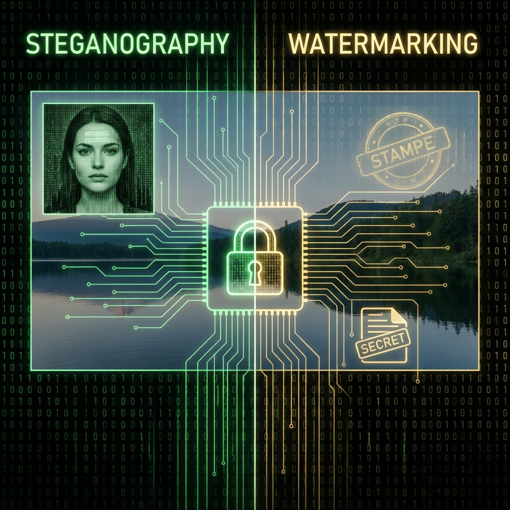

# 📝 Stenografi ve LSB Yöntemi

*Gizli Veri Saklama Sanatı*

---

---

# 📝 Stenografi Yöntemleri ve LSB

Stenografi, bilgiyi **gizli bir şekilde başka bir veri içinde saklama** sanatıdır. Görüntü, ses, video veya metin dosyalarında farklı tekniklerle uygulanabilir.

---

## 🔹 1. Metin Stenografisi

* **Boşluk ve karakter kodlarıyla gizleme:**

  * Satır sonlarına gizli mesaj bitleri eklenir.
  * Boşluk ve tab karakterleri mesaj iletmek için kullanılır.
* **ASCII ve Unicode kodlarıyla gizleme:**

  * Belirli karakterler, mesaj bitlerini temsil eder.

**Avantaj:** Basit, hızlı.
**Dezavantaj:** Çok fazla veri saklanamaz, kolay tespit edilir.

---

## 🔹 2. Görüntü Stenografisi

### a) **LSB (Least Significant Bit)**

* Pikselin en düşük anlamlı bitini değiştirerek veri saklama.
* İnsan gözüyle fark edilmez.

**Avantaj:** Görüntü kalitesi korunur.
**Dezavantaj:** Büyük mesajlar için çok piksel gerekir.

### b) **Palette-Based (Palet Tabanlı)**

* Renk paleti olan görüntülerde (GIF, PNG) belirli renkler gizli mesaj için değiştirilir.
* Özellikle düşük renkli resimlerde kullanılır.

**Avantaj:** Küçük dosyalar için ideal.
**Dezavantaj:** Palet değişirse mesaj bozulur.

### c) **Transform Domain (Dönüşüm Alanı)**

* DCT (Discrete Cosine Transform) veya DWT (Discrete Wavelet Transform) gibi matematiksel dönüşümler kullanılır.
* Mesaj, dönüşüm katsayılarına gömülür (JPEG sıkıştırması sonrası bile korunabilir).

**Avantaj:** JPEG ve diğer sıkıştırılmış formatlarla uyumlu.
**Dezavantaj:** Karmaşık algoritma, işlemci gücü gerektirir.

---

## 🔹 3. Ses Stenografisi

* Ses dosyalarında bit değiştirme veya frekans modülasyonu ile mesaj saklanır.

### Yöntemler:

1. **LSB Ses:** Ses dalgasının en düşük anlamlı bitlerini değiştirir.
2. **Phase Coding:** Faz değişiklikleri ile veri gömülür, algılaması zordur.
3. **Echo Hiding:** Ses dalgasına hafif yankı ekleyerek veri saklar.

**Avantaj:** Fark edilmesi zor.
**Dezavantaj:** Ses kalitesi etkilenebilir, sınırlı kapasite.

---

## 🔹 4. Video Stenografisi

* Görüntü ve ses birleşimiyle veri saklar.
* Tek tek karelerde LSB veya DCT yöntemi uygulanabilir.
* Yüksek kapasiteli gizli veri iletimine uygundur.

---

## 🔹 5. Dosya ve Ağ Stenografisi

* **Dosya adları, zaman damgaları veya meta veriler** ile gizli veri iletimi.
* **Ağ paketleri** üzerinde gizleme: paketlerin boyutu veya sıra düzeni mesaj iletmek için kullanılır.

---

## 🔹 Özet Avantaj ve Dezavantajlar

| Yöntem                | Avantaj                   | Dezavantaj                     |
| --------------------- | ------------------------- | ------------------------------ |
| Metin                 | Basit, hızlı              | Az veri, kolay tespit          |
| LSB Görüntü           | Görüntü kalitesi korunur  | Büyük mesajlar için yetersiz   |
| Palette-Based Görüntü | Küçük dosyalar için uygun | Palet değişirse bozulur        |
| Transform Domain      | Sıkıştırmaya dayanıklı    | Karmaşık, işlemci gücü gerekir |
| Ses                   | Algılanması zor           | Ses kalitesi etkilenebilir     |
| Video                 | Yüksek kapasite           | Karmaşık, büyük dosya boyutu   |
| Dosya/Ağ              | Gizli iletişim            | Karmaşık, tespit edilebilir    |

# 📝 Stenografi: LSB ve Alternatif Yöntemler

Stenografi, bilgiyi **gizli bir şekilde başka bir veri içinde saklama** sanatıdır. LSB (Least Significant Bit) yöntemi en bilinen yöntemdir, ama daha karmaşık ve gizli yöntemler de mevcuttur.

---

## 🔹 Görüntü Stenografisi Yöntemleri

| Yöntem                               | Açıklama                                                         | Avantaj                                                 | Dezavantaj                                         |
| ------------------------------------ | ---------------------------------------------------------------- | ------------------------------------------------------- | -------------------------------------------------- |
| **LSB (Least Significant Bit)**      | Pikselin en düşük anlamlı bitini değiştirir.                     | Basit, hızlı, görsel kalite korunur.                    | Büyük mesajlar için yetersiz, kolay tespit edilir. |
| **Palette-based**                    | Düşük renkli resimlerde renk paletini değiştirerek veri saklama. | Küçük dosyalar için ideal.                              | Palet değişirse veri bozulur.                      |
| **Transform Domain (DCT, DWT, DFT)** | Dönüşüm katsayıları üzerine veri gömme.                          | Sıkıştırılmış formatlarda dayanıklı, fark edilmesi zor. | Karmaşık, işlemci gücü gerektirir.                 |
| **Masking & Filtering**              | Önemli bölgelerde veri saklama (watermark için).                 | Görsel dikkat çekmez.                                   | Karmaşık, sınırlı kapasite.                        |
| **Spread Spectrum**                  | Veriyi tüm resme yayarak küçük parçalar hâlinde saklama.         | Algılanması çok zor, dayanıklı.                         | İşlemci gücü gerektirir.                           |

---

## 🔹 Ses Stenografisi Yöntemleri

| Yöntem              | Açıklama                                             | Avantaj           | Dezavantaj                 |
| ------------------- | ---------------------------------------------------- | ----------------- | -------------------------- |
| **LSB Ses**         | Ses dalgasının en düşük anlamlı bitlerini değiştirir | Basit, hızlı      | Ses kalitesi etkilenebilir |
| **Phase Coding**    | Sesin fazını değiştirerek veri saklar                | Algılanması zor   | Karmaşık                   |
| **Echo Hiding**     | Ses dalgasına hafif yankı ekler                      | Fark edilmesi zor | Ses kalitesi etkilenebilir |
| **Spread Spectrum** | Veriyi frekans bandına yayar                         | Güçlü gizlilik    | Karmaşık, sınırlı kapasite |

---

## 🔹 Video Stenografisi Yöntemleri

| Yöntem                         | Açıklama                                                             | Avantaj                       | Dezavantaj                       |
| ------------------------------ | -------------------------------------------------------------------- | ----------------------------- | -------------------------------- |
| **LSB Video**                  | Kare kare en düşük bitleri değiştirme                                | Basit, hızlı                  | Büyük mesajlar için yetersiz     |
| **Transform Domain Video**     | Karelerin DCT/DWT katsayılarını kullanma                             | Dayanıklı, sıkıştırmaya uygun | Karmaşık, işlemci gücü gerekir   |
| **Motion Vector Manipulation** | Video sıkıştırmasında hareket vektörlerini değiştirerek veri saklama | Algılanması zor, dayanıklı    | Çok karmaşık, büyük dosya boyutu |

---

### 🔹 Özet

* **LSB**, basit ve hızlıdır, eğitim amaçlı ve küçük gizli veriler için uygundur.
* **Transform domain, spread spectrum, masking gibi yöntemler**, daha güvenli ve dayanıklıdır, fakat karmaşık ve işlemci gücü gerektirir.
* Ses ve video stenografisi, LSB mantığını medyanın türüne göre uyarlayarak gizli veri iletimi sağlar.

# 📝 Stenografi: LSB ve Alternatif Yöntemler

Stenografi, bilgiyi **gizli bir şekilde başka bir veri içinde saklama** sanatıdır. LSB (Least Significant Bit) yöntemi en bilinen yöntemdir, ama daha karmaşık ve gizli yöntemler de mevcuttur.

---

## 🔹 Görüntü Stenografisi Yöntemleri

| Yöntem                               | Açıklama                                                         | Avantaj                                                 | Dezavantaj                                         |
| ------------------------------------ | ---------------------------------------------------------------- | ------------------------------------------------------- | -------------------------------------------------- |
| **LSB (Least Significant Bit)**      | Pikselin en düşük anlamlı bitini değiştirir.                     | Basit, hızlı, görsel kalite korunur.                    | Büyük mesajlar için yetersiz, kolay tespit edilir. |
| **Palette-based**                    | Düşük renkli resimlerde renk paletini değiştirerek veri saklama. | Küçük dosyalar için ideal.                              | Palet değişirse veri bozulur.                      |
| **Transform Domain (DCT, DWT, DFT)** | Dönüşüm katsayıları üzerine veri gömme.                          | Sıkıştırılmış formatlarda dayanıklı, fark edilmesi zor. | Karmaşık, işlemci gücü gerektirir.                 |
| **Masking & Filtering**              | Önemli bölgelerde veri saklama (watermark için).                 | Görsel dikkat çekmez.                                   | Karmaşık, sınırlı kapasite.                        |
| **Spread Spectrum**                  | Veriyi tüm resme yayarak küçük parçalar hâlinde saklama.         | Algılanması çok zor, dayanıklı.                         | İşlemci gücü gerektirir.                           |

---

## 🔹 Ses Stenografisi Yöntemleri

| Yöntem              | Açıklama                                             | Avantaj           | Dezavantaj                 |
| ------------------- | ---------------------------------------------------- | ----------------- | -------------------------- |
| **LSB Ses**         | Ses dalgasının en düşük anlamlı bitlerini değiştirir | Basit, hızlı      | Ses kalitesi etkilenebilir |
| **Phase Coding**    | Sesin fazını değiştirerek veri saklar                | Algılanması zor   | Karmaşık                   |
| **Echo Hiding**     | Ses dalgasına hafif yankı ekler                      | Fark edilmesi zor | Ses kalitesi etkilenebilir |
| **Spread Spectrum** | Veriyi frekans bandına yayar                         | Güçlü gizlilik    | Karmaşık, sınırlı kapasite |

---

## 🔹 Video Stenografisi Yöntemleri

| Yöntem                         | Açıklama                                                             | Avantaj                       | Dezavantaj                       |
| ------------------------------ | -------------------------------------------------------------------- | ----------------------------- | -------------------------------- |
| **LSB Video**                  | Kare kare en düşük bitleri değiştirme                                | Basit, hızlı                  | Büyük mesajlar için yetersiz     |
| **Transform Domain Video**     | Karelerin DCT/DWT katsayılarını kullanma                             | Dayanıklı, sıkıştırmaya uygun | Karmaşık, işlemci gücü gerekir   |
| **Motion Vector Manipulation** | Video sıkıştırmasında hareket vektörlerini değiştirerek veri saklama | Algılanması zor, dayanıklı    | Çok karmaşık, büyük dosya boyutu |

---

### 🔹 Özet

* **LSB**, basit ve hızlıdır, eğitim amaçlı ve küçük gizli veriler için uygundur.
* **Transform domain, spread spectrum, masking gibi yöntemler**, daha güvenli ve dayanıklıdır, fakat karmaşık ve işlemci gücü gerektirir.
* Ses ve video stenografisi, LSB mantığını medyanın türüne göre uyarlayarak gizli veri iletimi sağlar.

